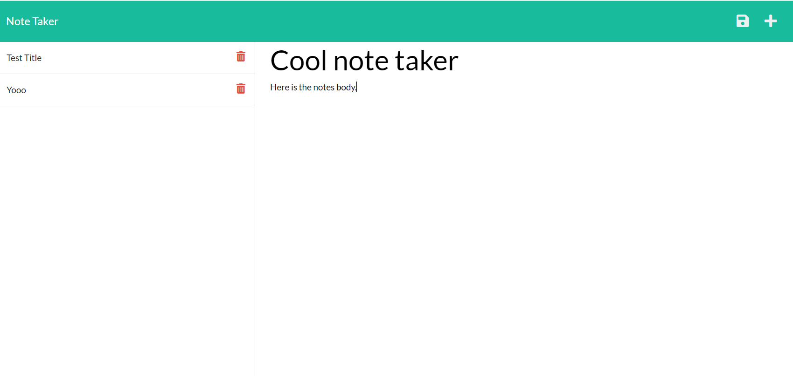

# expressNoteMaker  

## Description:

This project is to take the frontend of a webpage and create the backend using express.js. Every note created should be appended to the database. In this case the database is a JSON db. The backend responds to saving a file and appends that file to the list of notes. The notes on the list should once clicked should then occupy the create note space showing the contents of each note retrieved from the db.  
 
 
 [Note taker](https://sambalognanotetaker.herokuapp.com/)

## Table of Contents

* [Installation](#Installation)

* [Usage](#Usage)

* [License](#License)

* [Contributing](#Contributing)

* [Tests](#Tests)

* [Questions](#Questions)

## Installation

This project does not require installation as it is deployed on a heroku server. The project can be installed locally to run on the local host by running npm i within the folder the code is downloaded to. Then node server will start the server on the local host port designated. 

## Usage:

This app is useful for generating and storing notes for later use. 
 
## License: 

This project is covered under the The MIT License 
 
## Contributing:

Contribute by reaching out to the email provided under the questions section. 
 
## Tests:

This project does not have any tests. 
 
## Questions:

Here is my Github profile [My Github](https://github.com/Sambalogna)
 
Any Questions? Contact here: smandel4@gmail.com

                            